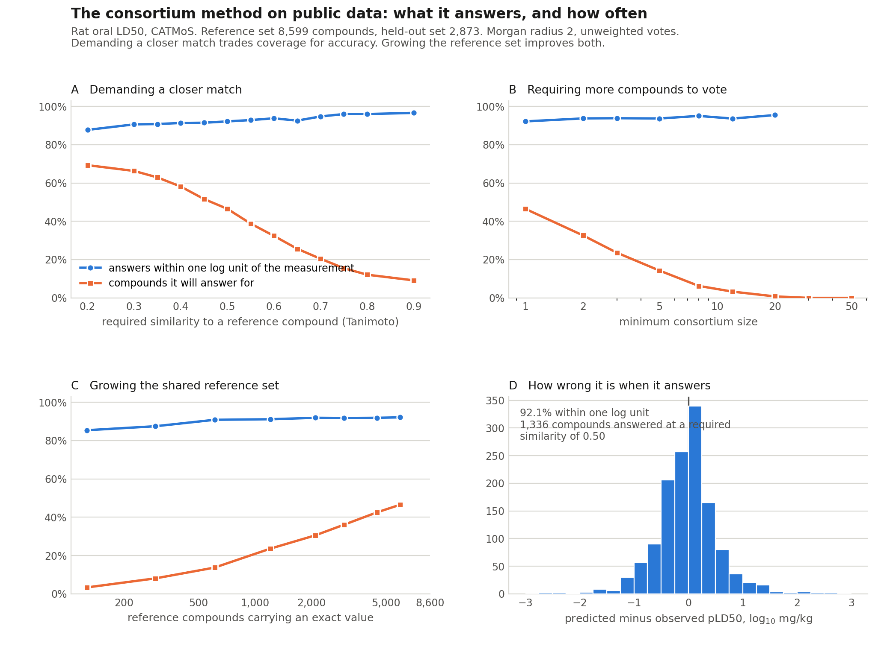
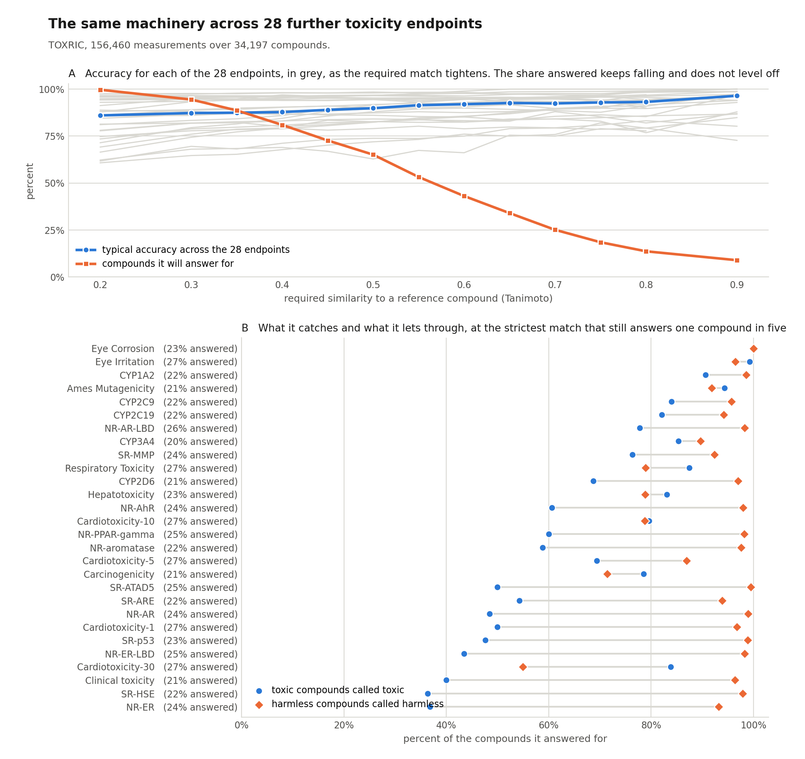
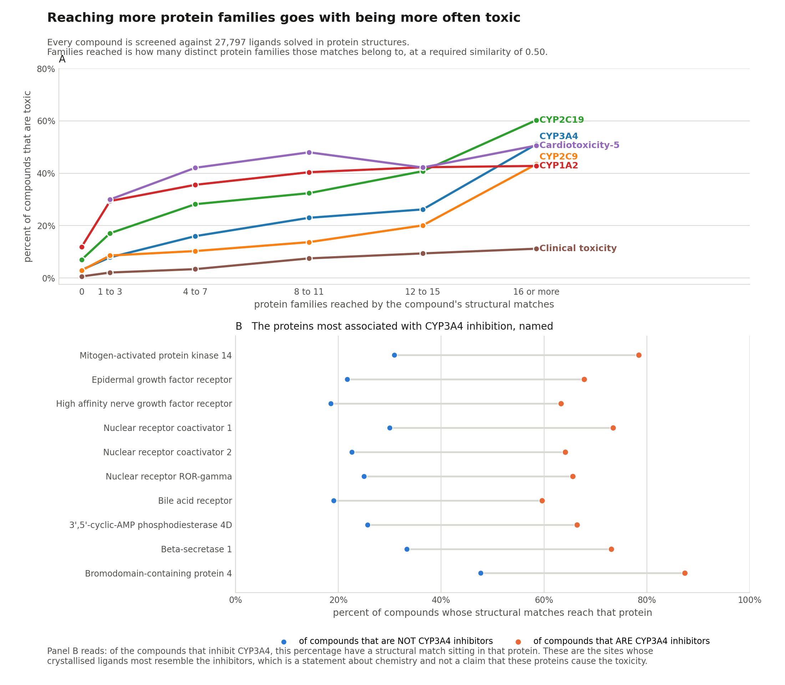

# toxpred

**A compound's toxicity can be gauged from the toxicities of the compounds it resembles.**

That idea is from a 2003 paper. This package rebuilds it on data anyone can
download, extends it to 28 further toxicity endpoints, and adds a second signal
the original could not compute: how many distinct protein families a compound's
chemistry reaches in the crystallographic record.

Nothing here needs a protein structure, a docking run or a conformer ensemble.

---

## What it does

```
$ toxpred score --smiles "CC(=O)Oc1ccccc1C(=O)O"

ACUTE ORAL TOXICITY, red at or under 50 mg/kg, green over 2000
  CC(=O)Oc1ccccc1C(=O)O: GREEN, 12 voters agreeing 58%, nearest 1.000

FURTHER ENDPOINTS
  endpoint                   call     agreement   voters
  CYP3A4                     clear         100%       11
  CYP2D6                     clear         100%        4
  Ames Mutagenicity          clear         100%        4
  Hepatotoxicity             TOXIC          67%        3
  Clinical toxicity          no call                   2
```

**`no call` is a real answer.** The method predicts only where the reference set
holds a compound similar enough to the query. For anything unlike what has been
measured, it declines instead of guessing, and a tie is not a majority.

---

## Install

Self-contained. Creates its own environment and touches nothing else.

```bash
git clone https://github.com/smuskal/toxpred.git
cd toxpred
conda env create -f environment.yml
conda activate toxpred
```

Then pull the public reference data once. It lands in `~/.toxpred`, or wherever
you point `TOXPRED_HOME`, never into your project.

```bash
toxpred fetch
```

That downloads roughly 90 MB: the curated rat oral acute toxicity set
distributed with OPERA, and the thirty standardized endpoint tables from TOXRIC.
Both are public.

---

## The trade you are always making

Demanding a closer match raises accuracy and lowers the share of compounds you
get an answer for. There is no setting that escapes it, so both numbers are
always reported.



Growing the reference set is the one move that does not cost anything. Panel C:
from 171 to 8,599 reference compounds, accuracy holds between 85 and 92 percent
while the share of compounds answered rises from 3 to 47 percent. **A bigger
shared reference set buys reach, not accuracy**, which is why pooling is worth
something to everyone who contributes.

Turn the dials yourself:

```bash
toxpred score --input molecules.smi --cutoff 0.65 --min-members 3
```

---

## The same machinery on 28 more endpoints

Five cytochrome P450 isoforms, cardiotoxicity at four thresholds, Ames
mutagenicity, carcinogenicity, hepatotoxicity, twelve nuclear receptor and
stress response assays, eye irritation and corrosion, respiratory,
developmental, reproductive and clinical toxicity.

```bash
toxpred endpoints                       # list them
toxpred score --smiles "..." --endpoints "CYP450_CYP3A4" "Hepatotoxicity_Hepatotoxicity"
```



**Panel A** is the same trade as above, one gray line per endpoint. Accuracy
gains are mostly spent by a required similarity of about 0.6; the share of
compounds answered for keeps falling to 8.6% at 0.90 and never levels off, so
the axis runs to zero rather than cutting that curve off.

**Panel B** ranks the 28 endpoints by the Matthews correlation between the call
and the measurement, with the share of measured toxic compounds caught and the
share of measured harmless compounds passed printed beside each bar. Gray bars
rest on 20 or fewer measured toxic compounds and are too thin to rank.

Percent correct is not reported, and no majority-class comparison is drawn. These
labels are lopsided, 87 to 13 on CYP2D6, and that ratio records which compounds
someone chose to test and publish rather than anything about chemistry. Matthews
correlation draws on all four cells of the table, so no answering strategy
inflates it, and its zero means no relationship rather than a rate that happens
to match the reporting.

Read it for where the tool earns its place. Eye corrosion and CYP1A2 sit at 1.00
and 0.91. The estrogen receptor assay sits at 0.35: it catches 37% of measured
actives while passing 93% of inactives, which is conservative rather than wrong,
and worth knowing before you rely on it.

---

## Cross-family reach, the second signal

How many distinct protein families does a compound's chemistry reach among the
ligands solved in protein structures? Compounds that reach widely are more often
toxic.



A compound whose matches reach no family inhibits CYP3A4 3 percent of the time.
One reaching sixteen or more inhibits it 51 percent of the time. The same
ordering holds for the other cytochromes, for nuclear receptor binding and for
clinical toxicity.

This is measured with no access to how many assay panels a compound has been
through, which is the confound that makes measured promiscuity hard to read.

### This part runs locally on PharmCast

The published index stores a pharmacophore fingerprint per ligand, so a query
has to be fingerprinted the same way to be comparable. PharmCast does that, it
is open, and it runs on your own machine. CPU only; the network is small enough
that a GPU buys nothing.

- **https://github.com/smuskal/pharmcast**
- **https://pharmcast.ai**

```bash
pip install git+https://github.com/smuskal/pharmcast.git
toxpred score --smiles "CC(=O)Oc1ccccc1C(=O)O" --reach
```

That is the whole setup. On first use toxpred pulls two more things and verifies
both, then works offline:

| what | from | verified against |
|---|---|---|
| the PharmCast checkpoint | `pharmcast.ai/models` | its published `SHA256SUMS` |
| the Reverse Screen index | `reversescreen.ai` download API | the per-file SHA-256 in its manifest |

**Which checkpoint.** This package downloads `pharmcast_scp_v10.pt`, the
checkpoint published at `pharmcast.ai/models`, and every reach number in this
repository was produced with it. Reach reports print the checkpoint they ran
beside the index version, so a number can always be traced to what made it.

**When the index is fetched.** Not on a plain `toxpred fetch`, which pulls only
the toxicity data. It is fetched by `toxpred fetch --with-reach`, and by the
first `toxpred score --reach` if you skipped that. Either way the download API
is asked for its manifest at the moment you run it, and the published filenames
carry the release date, so **a new release is a new filename and is downloaded**.
An older copy sitting in the cache is never used in its place. The version in
use is printed on every reach report and written into `toxpred provenance`.

Requests to both sites identify themselves as `toxpred/<version>` with a link
back to this repository, so a run of this package is distinguishable in their
logs from someone downloading the index by hand.

```
CROSS-FAMILY REACH, index version 2026-09-20
  query                                          matches   targets  best sim
  CC(=O)Oc1ccccc1C(=O)O                               10        36     0.707
```

Every fingerprint operation is PharmCast's own: `read_pfp` for the index,
`PharmCast.words_batch` for the queries, `pharmtan_matrix` for the comparison.
None of the packing or bit ordering is reimplemented here, so the query and the
index cannot drift apart.

Group the targets into families your own way with `--family-map`, a two column
accession and family file. Without one, reach is reported as distinct targets,
which needs nothing but the index.

Everything else in this package works without PharmCast installed, and says so
rather than failing.

#### Verified from a clean machine

This path was tested from an empty virtual environment, installing only from
the public repositories, and it reproduces the numbers above exactly:

```bash
python -m venv env && source env/bin/activate
pip install git+https://github.com/smuskal/pharmcast.git
pip install git+https://github.com/smuskal/toxpred.git
toxpred score --smiles "CC(=O)Oc1ccccc1C(=O)O" --reach
```

---

## Triaging a library

You have a virtual library. Nothing in it has been measured, and you want to
know which compounds to look at hardest before spending anything on them.

Score all of them, rank them by score, and take the worst tenth. That is the
whole operation. The claim is about what ends up in that tenth.

**How that claim was measured.** On compounds that had been measured, held out
of the reference set so the method never saw their labels. Score them, take the
worst tenth, then reveal the labels and count. Against the rate in the full set,
the worst tenth holds **6 times as many androgen receptor ligands, 3 times as
many CYP2D6 inhibitors, and 3 times as many clinically toxic compounds**. In
use the labels are not there to reveal, which is the point; the enrichment
measured on compounds with known answers is what you are relying on when you
apply it to compounds without.

The enrichment is largest where the outcome is rare, and that is where a filter
is worth running. Hepatotoxicity is carried by half of its reference set, and
the worst tenth holds 75 in 100 against 50 in 100 across the whole set.

---

## Where the numbers come from

**No data ships with this repository.** It is 2.3 MB of source and three
figures. Everything else is fetched once, on `toxpred fetch`, into `~/.toxpred`
and then used locally. After that first fetch, scoring makes no network call at
all.

In a consortium method the reference set *is* the model, so two people with
different reference sets get different answers. That has to be visible rather
than inferred, so every fetch is written down:

```bash
toxpred provenance
```

```
catmos_reference
   from    https://raw.githubusercontent.com/NIEHS/OPERA/master/OPERA_Data.zip
   file    catmos_experimental.csv, 1,705,787 bytes
   sha256  21db78b60b573681c276ec157d15a7ba382cba55dfcc9e39131a96a4496f3ddc
   fetched 2026-09-20T16:29:42Z
   note    11989 experimental rows of 50660 records
```

and every score prints the fingerprint of the reference set it actually used:

```
acute toxicity reference set: 11472 compounds, fingerprint 8216f99c4ee5
```

**Quote that fingerprint beside any number.** Two runs that agree on it were
answering from the same reference set. Two that do not were not, however alike
the rest of the setup looked.

One source is worth knowing about. The Reverse Screen index and the PharmCast
checkpoint are both released with published checksums, and toxpred verifies
them and refuses a mismatch. TOXRIC is a fixed figshare file id, so it is
stable. **CATMoS arrives inside `OPERA_Data.zip`, which tracks its repository's
default branch and carries no upstream version tag**, so if that file is
rebuilt your reference set can change. The manifest records the checksum of
what you actually received, which is what makes the change detectable.

---

## Data sources, all public

| source | what | where |
|---|---|---|
| CATMoS | rat oral acute toxicity, curated by NICEATM and US EPA | distributed with [OPERA](https://github.com/NIEHS/OPERA) |
| TOXRIC | 30 standardized toxicity endpoints | [toxric.bioinforai.tech](https://toxric.bioinforai.tech/) |
| Reverse Screen index | ligands solved in protein structures, with their targets | [reversescreen.ai](https://reversescreen.ai) |
| PharmCast | the fingerprint the index is built on | [pharmcast.ai](https://pharmcast.ai) |

Only experimental values are used as reference values. The CATMoS file also
carries consensus model predictions for compounds that were never measured, and
those are filtered out rather than inherited from.

---

## Contributing data back

**The reference set is the model, and everyone who adds to it gets the benefit
back immediately.** There is no training step. A compound you add is available
to every query the next time one is run, including your own. Growing the
reference set from 171 to 8,599 compounds took the share of compounds the method
will answer for from 3% to 47%, with accuracy unchanged. Each contribution
widens the region of chemistry where anyone gets an answer instead of a decline.

**Toxicity findings are also the least sensitive data a discovery organisation
holds.**
When a compound shows toxicity, the usual consequence is that it gets
deprioritised or the program is terminated. Nobody prosecutes a composition of
matter claim on chemistry they have stopped working on, and nobody advances it.
So the data most worth pooling is the data an organisation has the least reason
to protect, and a finding that cost one company a program can stop three others
repeating it.

That is the whole argument for a shared reference set, and it is why this package
writes to the index as well as reading from it.

```bash
toxpred contribute --input mydata.csv --out contribution.json
toxpred contribute --input mydata.csv --out contribution.json --format fingerprint
```

`mydata.csv` needs a `smiles` column. Every other column is treated as an
endpoint measurement. Two formats:

| | what leaves your machine | carries |
|---|---|---|
| `counts` (default) | four integers per compound: protein families reached, proteins reached, indexed ligands matched, safety panel proteins reached | cross-family reach |
| `fingerprint` | the folded Morgan fingerprint | both signals |

**Nothing is uploaded.** The command writes a file you read before sending it
anywhere.

`counts` releases no structural descriptor and no published method recovers a
structure from it, so it is usable for chemistry still in play. `fingerprint`
carries both signals and is the better contribution where the chemistry is
settled, which for toxicity findings it usually is. For completeness: published
work reverse-engineers a fraction of structures from folded fingerprints, around
11% of one company's proprietary compounds at 1024 bits
([Le et al., *Chem Sci* 2020](https://doi.org/10.1039/D0SC03115A)).

---

## Citing

This package and the work behind it:

> Muskal SM, Jha SK, Kishore P, Tyagi P. Toxicity by Consortium Revisited:
> Structural Neighbors and Cross-Family Reach. Manuscript in preparation, 2026.
> Software: https://github.com/smuskal/toxpred

The method it returns to:

> Muskal SM, Jha SK, Kishore MP, Tyagi P. A simple and readily integratable
> approach to toxicity prediction. *J Chem Inf Comput Sci* 2003;43:1673-1678.

The manuscript rebuilds that 2003 consortium method on public data twenty three
years on, extends it unchanged to 28 further toxicity endpoints, and adds
cross-family reach as a second signal computed from two-dimensional structure
alone. Every figure in this README is taken from it. A preprint link will replace
this note once it is posted.

The data and the retrieval index carry their own citations, listed above.

---

## License

MIT. See [LICENSE](LICENSE).
